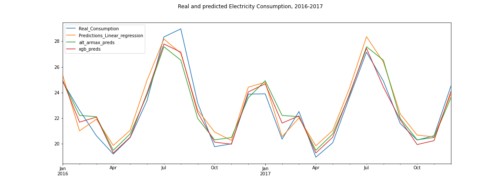
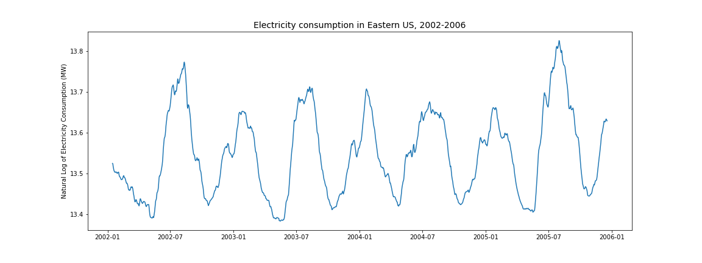
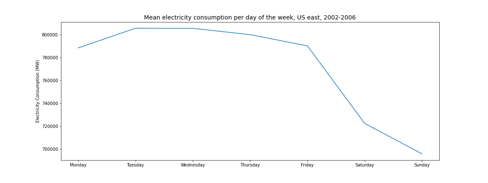
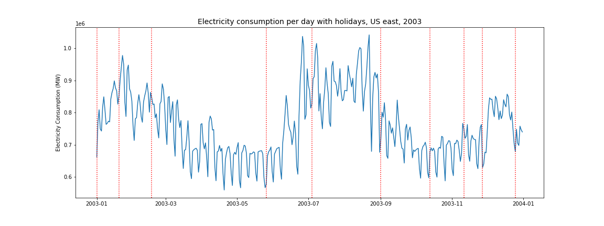
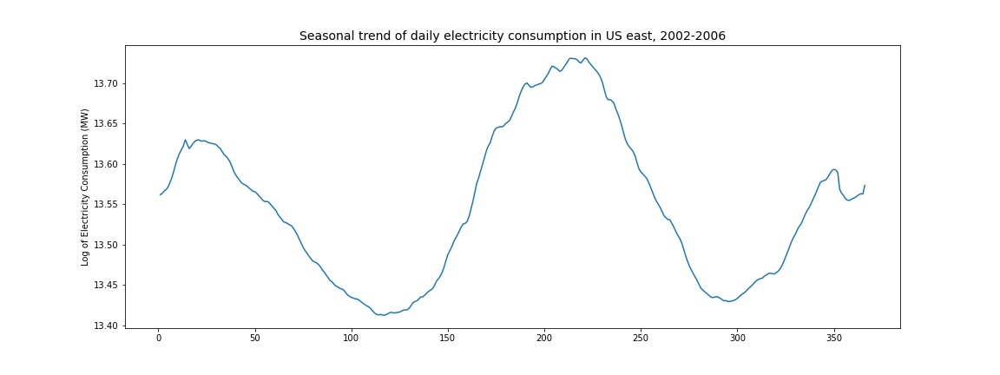
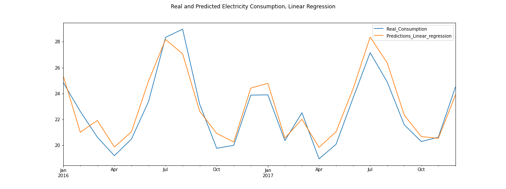
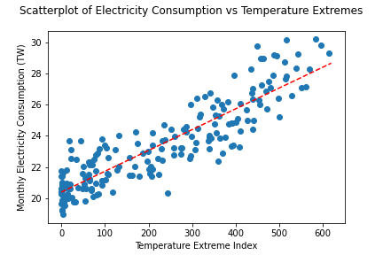
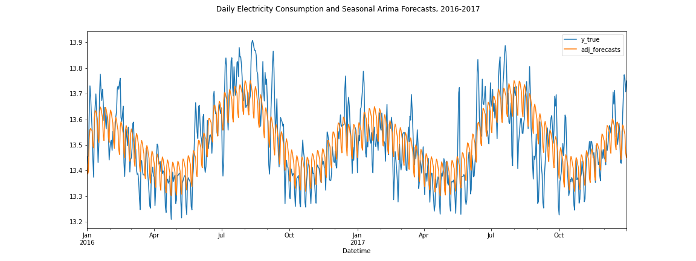
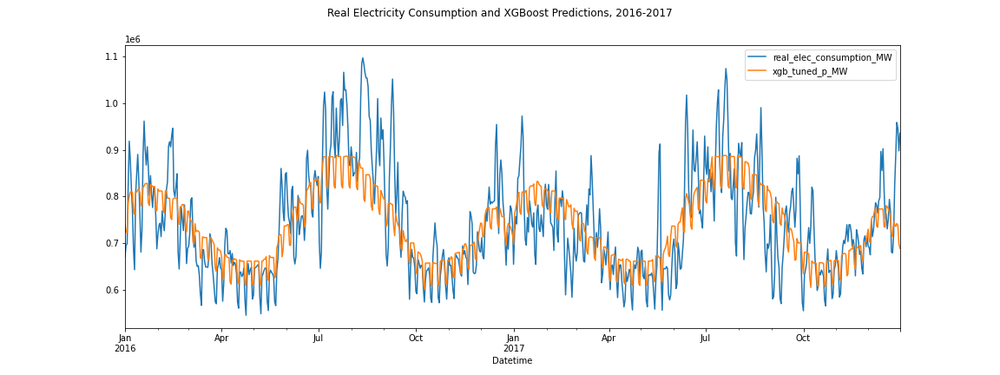

# Predicting Electricity Demand

# Executive Summary

In this project, we use various models to predict electricity demand on a daily and monthly basis.

We start with a time series from the PJM Interconnection LLC (PJM), a regional transmission organization (RTO) in the United States. This is an electric transmission system which serves all or parts of several states in the eastern part of the US, including Delaware, Illinois, Indiana, Kentucky, Maryland, Michigan, New Jersey, North Carolina, Ohio, Pennsylvania, Tennessee, Virginia, West Virginia, and the District of Columbia. The data which we looked at contains hourly data on electricity consumption for the whole east of the United States from 2002 to mid 2018. This data can be downloaded here:
https://www.kaggle.com/robikscube/hourly-energy-consumption?select=PJME_hourly.csv

The time series is resampled to daily data, and is then split into several parts: 
- The first 4 years were used for calculating a general trend of what could be expected for electricity demand in a typical year. 
- The next 10 years were used for training various models: these models include seasonal ARIMA and XGBoost.
- Then, the results of the prediction models are evaluated on a withheld testing set which contains the electricity demand for the years 2016 and 2017. 
- Once the models have been properly tuned, fit and adjusted, residual errors are analyzed. We find that most residual errors can be explained by factors related either to unusual weather or to natural disasters (cyclones or hurricanes which led to local power outages).

A further analysis is then conducted which integrates actual weather observations as an exogenous variable into prediction models. Obviously, this is not completely realistic as it would not be possible to forecast the weather so far in advance. Nevertheless, we find that integrating weather data into electricity forecasting significantly reduces the model error. This finding has some relevance, as highly accurate weather forecasts may be obtained more than a week in advance: using this knowledge could facilitate adjustments of electricity production which does not have fast reaction times, for example nuclear power plants. 

Note that due to issues with data availability and cost, the notebook which incorporates weather into the predictions makes predictions only on monthly data based on observed monthly mean temperatures for the entire United States. With more accurate geographical and temporal data, more accurate predictions could no doubt be made, as our analysis shows that it is temperature extremes that have the most impact on energy consumption, not temperature means.

## Notebooks 

This project contains the following notebooks:

- [1.Basic_EDA_and_Data_Cleaning](https://github.com/nicsaunier/Electricity_TSA/blob/master/1.Basic_EDA_and_Data_Cleaning.ipynb)  
As the name indicates, this notebook contains scripts to properly import and clean the data for further processing, as well as basic exploration of electricity trends over different periods.  

- [2.Daily_Electricity_Consumption_Analysis_Forecasting](https://github.com/nicsaunier/Electricity_TSA/blob/master/2.Daily_Electricity_Consumption_Analysis_Forecasting.ipynb):  
In this notebook, we fit a seasonal ARIMA model to the training data and look at the results, with an in-depth investigation of the biggest errors made by the model. 

- [3.Daily_Electric_Consumption_Prediction_XGBoost](https://github.com/nicsaunier/Electricity_TSA/blob/master/3.Daily_electric_consumption_prediction_XGBoost.ipynb)  
Prediction of daily electricity consumption using the XGBoost algorithm. The model's predictions are compared with those made by the seasonal ARIMA model.

- [4.Monthly_Electric_Consumption_and_Weather](https://github.com/nicsaunier/Electricity_TSA/blob/master/4.Monthly_Electricity_Consumption_and_Weather.ipynb)  
This notebook merges our original data, resampled by month, with data on the weather in the United States over the same period. We then create 3 models to predict monthly electric consumption based on the available data: a linear regression model, a SARIMAX model (Seasonal ARIMA with eXogenous variables) and an XGBoost model.

## Problem Definition

Predicting energy demand is crucial to electricity providers: at any time, if the energy demand exceeds supply, a blackout or brownout can occur, with major economic and social consequences. While electricity providers can decide to operate with a wider safety margin, this is very costly, as the extra electricity that is produced must be used somewhere, and in practice is often sold at a loss, including, if necessary, at a negative price.

Having accurate forecasts of energy demand can be beneficial in the short, medium, and long term. In the short term (minutes to one day), the output of power plants which can quickly respond to increased or decreased demand can be turned up or down accordingly, thus limiting the amount of electricity which needs to be sold at a loss. In the medium term (several days to months), adjustments can be made to the output of nuclear power plants, which take longer to respond to variations in demand but have lower marginal costs (fuel represents a very small percentage of the operating costs of nuclear plants, for which the main costs are infrastructure and safety/maintenance) and also have the advantage of emitting no greenhouse gases (an advantage which should play an increasing role in energy production strategies as climate change is a growing concern). In the longer term (months to years), accurate forecasts could guide plant maintenance and infrastructure decisions.

## Data Discovery

#### The seasonal component of energy demand

Seasonality is obviously a big part of energy demand forecasting: the plot below shows the electricity consumption for the first four years of the data, smoothed through a 28-day rolling average:

 

The first 14 days and last 14 days of data are missing in this plot as this is a centered 28 day moving average on the first 4 years of the data. However, we can easily observe the repeating seasonal trends:
- Each year has two peak periods for electricity consumption, one in winter and one in summer.  
- The summer peak is often higher than the winter peak.
- Electricity demand is usually the lowest in May and in October.

Note how months of low electricity demand correspond to months when the temperature is generally mild, whereas months of high electricity demand corresponds to periods when it is either cold or warm. This will come into play later when we see how temperature extremes can be used to improve energy demand forecasting.

#### Weekly trends in energy demand

Electricity demand is not only driven by home uses, but also by industry and economic activity. For this reason, energy demand is usually higher on weekdays than on weekends, and slightly lower on Mondays and Fridays than in the middle of the work week.

 

#### Energy Demand and the Weather

Peaks in energy demand were seen to correspond to days of extreme heat, or more rarely, extreme cold. Heat has a stronger effect as air conditioning is almost always powered by electricity, whereas heat can come from many different sources which were not accounted for here. 52 degrees Fahrenheit, or approximately 11 degrees celcius, was found to be the mean monthly temperature associated with the lowest consumption of electricity, though this is a national average temperature and it is possible that the temperature in the region was different.

#### Energy Demand and Holidays

The effects of holidays are best viewed when looking at an entire year's raw data with lines indicating the holidays on that year. Note that most holidays see reduced energy demand similar to that of a given Sunday.

## Model Development

### Algorithms Used

#### ARIMA and Seasonal Arima  

ARIMA, which stands for Auto Regressive Integrated Moving Average, is an algorithm which was designed for time series analysis. It is a mathematical generalization of several methods used for time series analysis: Exponential Smoothing, Random Walk and Auto Regression models can all be expressed in ARIMA terms. ARIMA, or rather a more advanced version, SARIMA (Seasonal ARIMA) was the algorithm of choice for when the energy demand predictions were made using only previous energy demands.
Basic ARIMA is a model with 3 parameters, p, d, and q:
- p is the AR term: it indicates the number of previous data points which need to be used for auto regression.
- d is the differencing term: it indicates the order of differencing of the series in order to make it stationary.
- q is the MA term: it indicates the number of terms which need to be considered in order to calculate the divergence of the series from its moving average.

The final model which was chosen for estimation of daily data was a SARIMA (3, 0, 0) x (0, 1, 1, 7) model. 
- Note that in the non-seasonal order, the model is only auto-regressive: it is not a full, complex ARIMA model but a simple auto regressive model which uses the values of the 3 previous days in order to make its predictions. 
- Similarly, in the seasonal order terms, only two terms have a non 0 value: the differencing term, which indicates that data needs to be differenced exactly one time, at the seasonal level, meaning weekly in this case as the seasonal part of the model was made to deal with weekly trends, and the moving average term. An ARIMA 0,1,1 model is actually a model which does simple exponential smoothing in order to calculate a moving average in which more recent observations in time have more weight and more distant observations have less weight.

However, a SARIMA model alone would not suffice to predict energy demand, which we have seen has seasonal trends and weekly trends as well as auto-regressive behavior. In order to model this kind of data, one would have to either remove the seasonal component first, or remove the weekly trend first. In practice, removing the seasonal trend produced better results. How this was done is explained below. 

#### Preparing the data for ARIMA

The seasonal trend of the data repeats each year with a pattern that is quite regular. There are several ways in which a seasonal trend can be calculated, including built in methods in the statsmodels library like seasonal_decompose. Unfortunately, with our data, seasonal_decompose did not manage to differentiate between trend and seasonality. Therefore, the seasonal detrending was performed 'manually', in several steps:
- training data was split into the first 4 years, which were used to determine the seasonal trend, and the next 10 years, which were kept for training the SARIMA model. Note that 4 years of data were needed in order to pick up trends with exactly one leap year, otherwise the model would have been confused when it had to deal with a day number 366. This is all the more important as 1st of January is a holiday.
- the first 4 years of data was smoothed using a 28-day centered rolling mean: this means that for each day, the value which was kept for the trend was the mean value of 4 weeks centered around that day. Again, the choice of 28 days is not random: any rolling mean which would be calculated on a number of days other than a multiple of 7 would have noisy behaviour due to picking up more or less data from weekends and weekdays.
- once we had a value for each day in the 4 year period, the mean value for each day number was then set as the expected seasonal trend value for that day.
- however, rolling means imply that some of these means were only calculated on a period of 3 years, so a small extra smoothing step was made in order to avoid putting in noise due to that change.

Once these steps were done, we ended up with the following seasonal trend:

This seasonal trend was then substracted from the actual predicted data in order to obtain a detrended electricity consumption data which was stationary, meaning that its pattern looked like random noise, that it had no trend in mean, variance, or autoregression. Data needs to be stationary in order to be put into an ARIMA model, as stationarity is one of the hypotheses on which the ARIMA model is based. This stationarity was tested using an adfuller test, and the auto-correlation and partial auto-correlation of the data were plotted in order to help determine the coefficients for the ARIMA model.

#### Arima with eXogenous components

The SARIMAX (seasonal ARIMA with exogenous components) model was only used in the notebook in which we made predictions based on the weather. Sarimax simply adds exogenous variable to the model in order to produce its prediction. In practice, while SARIMA did better than other algorithms, including XGBoost, when no exogenous variables were included, XGBoost performed much better, and even simple Linear Regression using Ordinary Least Squares performed better once weather data was taken into account.

There is, however, a major caveat to this analysis:  _for real future forecasting, including an exogenous variable in the model requires having an accurate forecast of this variable_

In practice, this is not always feasible, at least not for long term prediction. For energy demand forecasting, however, short and even medium term demand forecasts could greatly benefit from integration with accurate weather forecasting.

#### Simple Linear Regression

Once weather was integrated, simple linear regression worked quite well, producing predictions that had a lower Root Mean Squared Error than those of the SARIMAX model. 
Note that the linear regression model did not take any date variables into account: instead, its predictions were based on the predicted seasonal trend on that particular date and the divergence between the observed temperature extreme and the expected temperature extreme.
Also, and most importantly for this kind of data, note that the fact that we are using linear regression does not mean that our predictions come out as a straight line: the linear component describes the nature of the relationship between the predictor variables and the outcome. In fact, as you can see below, the predictions follow seasonal trends quite well, even with such a simple model and on an 'unseen' validation set.

#### The temperature extreme feature used to integrate weather into the analysis

Mean monthly temperatures around 52 degrees Farenheit (approx. 11 degrees celsius) were found to be associated with the lowest levels of energy consumption. Note that this does not exactly mean that the temperature in those regions was 52 degrees Farenheit, as the temperature means that could be obtained for the whole time series were for the entire United States. Nevertheless, as can be seen in the scatterplot below, the feature that we created for temperature extremes, which is the squared difference between the observed mean temperature for the month and 52, has clear predictive value for energy consumption, with an R-squared value of .794 (almost 80% of the variance in energy consumption can be explained by temperature variations alone).

#### XGBoost

XGBoost stands for eXtreme Gradient Boosting. It is an ensemble tree type of algorithm which improves on traditional gradient boosted trees. XGBoost was chosen as it is known to perform well on time series data (and in general, tends to be one of the algorithms that performs best on any kind of regression or classification task). The way XGBoost works for regression can be summarized like this:
- first, XGBoost makes a single prediction for all of the data.
- then, the residuals of that prediction are calculated, and a similarity score is calculated for those residuals. The numerator of this similarity score is the squared sum of the residuals. Since residuals themselves are not squared, residuals with different signs cancel each other out.
- after that, XGBoost looks for a split in the data that can result in an increase of similarity scores, or gain, that is the highest possible: for example, if XGBoost split the first tree into raw temperatures below 60 and above 60, it would then have two estimators with two sets of residuals instead of the one of its original estimate, and most likely, each set of residuals would be more similar than the residuals of the original prediction, resulting in an increase of similarity scores called gain. The best split is chosen based on the maximum gain, for the separations that XGBoost can make, which depend on how many columns XGBoost is considering to split the data. The percentage of columns to use in building each tree is a hyperparameter, see XGBoost Hyperparameter tuning in the Daily Predictions with XGBoost notebook for more details.
- XGBoost keeps separating the data until doing so results in no more gain or until the tree is as deep as we have specified that we want it to be. Several regularization terms can be added, which affect the calculation of gain. Adding regularization terms avoids overfitting, by preventing splits that don't lead to a certain threshold of gain or branches of trees which don't include enough observations (see the parameter tuning section for more  details).
- Once the tree has been built, a prediction value is calculated for each node. XGBoost then adjusts the predicted values of data points based on these values, but this adjustment is slow: just like in traditional gradient boosting, XGBoost uses a learning rate, which we specify, in order to make small adjustments to its predictions.
- Then, additional trees are  built based on the residuals of the previous trees. XGBoost keeps building trees until it reaches the maximum number of trees which we specified, or until there is no more improvement from adding more trees if we have enabled early stopping.

### Validating the Model

#### Specifics of data validation for time series

Validation of time series data is different from validation of ordinary data, as the test data cannot be chosen randomly, because data at any given point in time t is highly related to its neighbors at t-1 and t+1. Therefore, in order to test the effectiveness of a time series forecasting model, it's necessary to split the data in a training set that runs until a certain period, and a validation set that starts after the end of that period and extends into a future that we still know about. In this case, data from before 2016 was used to train the model, and data from 2016 to 2017 was used to validate it.

#### Validation metrics

Two main metrics were used to compare model predictions: Root Mean Squared Error (RMSE) and Mean Absolute Percentage Error (MAPE). RMSE is probably the most standard metric to use for any regression task, as it expresses the error in the same unit as the original data and gives more weight to large errors (which, in most cases, are what we want to avoid). MAPE is usually considered a good metric for time series analysis, it doesn't give more weight to large errors, which makes it less sensitive to outliers, and it is very easy to interpret: MAPE of x means that predictions are off by x%.

### Analysis of prediction results

#### Time Series Modeling without exogenous components

We first predicted the daily electricity consumption values with seasonal ARIMA. This model gave us predictions which had a root mean squared error of 76277 MW, corresponding to a mean absolute percentage error of approximately 8%. By comparison, a baseline model which would have made predictions based on a rolling mean for the first 4 years of data would have had a RMSE of 83679 MW, corresponding to MAPE of 9%.

The notebook on daily electricity consumption modeling with ARIMA contains an in-depth exploration of the errors made by the model. These errors were shown to be mostly due to weather extremes or natural disasters like hurricanes disrupting the power grid.

Predictions of daily electricity consumption were also made with XGBoost. This required a lot of feature engineering, and produced predictions that were surprisingly close to the predictions made by the ARIMA model. The RMSE of the XGBoost model was slightly worse, but the MAPE was slightly better, without those differences being so large as to be considered significant.

#### Time Series Modeling with additional weather data

Since the in-depth exploration of residuals that was conducted after the SARIMA model was fit showed that most of the biggest errors could be attributed to the weather, weather data was added as an exogenous predictor.
Unfortunately, this could only be done on a monthly basis, due to data availability. However, this led to a lot of improvement in predictions.

<table border="1" class="dataframe">
  <thead>
    <tr style="text-align: right;">
      <th></th>
      <th>rmse</th>
      <th>mape</th>
    </tr>
    <tr>
      <th>model</th>
      <th></th>
      <th></th>
    </tr>
  </thead>
  <tbody>
    <tr>
      <th>Predictions_Linear_regression</th>
      <td>0.95</td>
      <td>3.58</td>
    </tr>
    <tr>
      <th>alt_armax_preds</th>
      <td>0.93</td>
      <td>3.11</td>
    </tr>
    <tr>
      <th>xgb_preds</th>
      <td>0.68</td>
      <td>2.29</td>
    </tr>
  </tbody>
</table>

Baseline predictions predicting electricity consumption for  each month in 2016-2017 from the means for those months in previous years had a root mean squared error of 1.28 TW per month and a mean absolute percentage error of 4.8%. When predicting energy consumption based on the observed temperatures for those months, the root mean squared error was 1.18 TW, and the MAPE was 4.4%.

In contrast, more complex models were able to  produce more accurate predictions: by far the best model was XGBoost, with a Root mean squared error of less than 0.7 TW per month and a mean absolute percentage error of 2.3 % after some tuning of hyperparameters.
